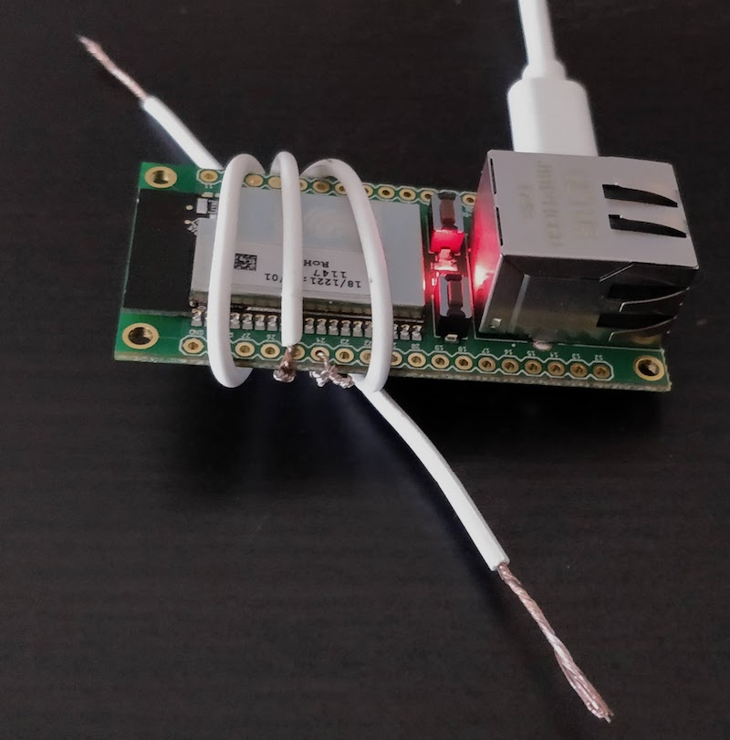

# neonious-hue

Sunday Morning Project: control **Philips Hue** lights using a **Neonious One** Technology Preview device (given out at JSConf.eu)

The Neonious has some touch-enabled pins, to which I connect some wires; everyone _just loves_ the concept of touching some bare electrical wires, attached as if by a 4-year-old, to get the fucking kitchen lights on.

- Neonious One: https://www.neonious.com/
- TP version docs: https://www.neonious.com/TPManual
- Poller uses hue-sdk to actually talk to Hue: https://www.npmjs.com/package/hue-sdk



## Control your Hue lights (with a huge lag...) using a Neonious One

The neonious I got does not have a way to make outbound requests. 
I dunno if this is a limitation of the TP or my own ignorance.

To work around it, I use the neonious's web server to expose the data, and a
separate, poller program (that should run under full Node.js or Docker) to actually
control the lights.

This of course causes everything to be very, very slow, and the CPU/energy
usage of the Neonious to be very high. Polling the neonious is far from ideal.

Maybe when/if Neonious gets some request/socket/whatever capabilities this can be done the opposite way 
(eg, neonious sends requests to a server process that actually talks to Hue).

### Neonious script

- Lives in `neonius/index.js`
- Assumes you have some bare/exposed wires connected to pins 24 and 25, which are touch-capable
- Is a huge hack, specially the debouncer.
- Should go "into" neonious IDE into `src/indexjs`

### Poller script

- Lives in `server/poller.js`
- Environment variables:
  - _Get those by using `hue-adm` https://github.com/bahamas10/hueadm (follow his instructions)_
    - `HUE_USER`: the token/user for Hue
    - `HUE_HOST`: the host or IP address for the Hue Bridge
  - `NEONIOUS_HOST`: the host or IP address of the Neonious. works with both Wifi and Ethernet!
  - _Use `hueadm lights` to list your lights and their IDs_
    - `RED_LIGHT_ID`: the id for the 'red' light
    - `GREEN_LIGHT_ID`: the id for the 'green' light

### Docker

WTF. Why do I have to add Docker to everything?!
But it does make running the server/poller part easier.
Dont forget to set the `--env`'s according to above.

```bash
# Build docker image
docker build -t neonious-hue:latest .
```

```bash
# test run with:
docker run --rm --name neonious-hue --interactive --tty --env HUE_USER=..token... neonios neonious-hue:latest
```

```bash
# daemon run:
# docker run --name neonious-hue --restart always --detach --env HUE_USER=..token... neonious-hue:latest
```
